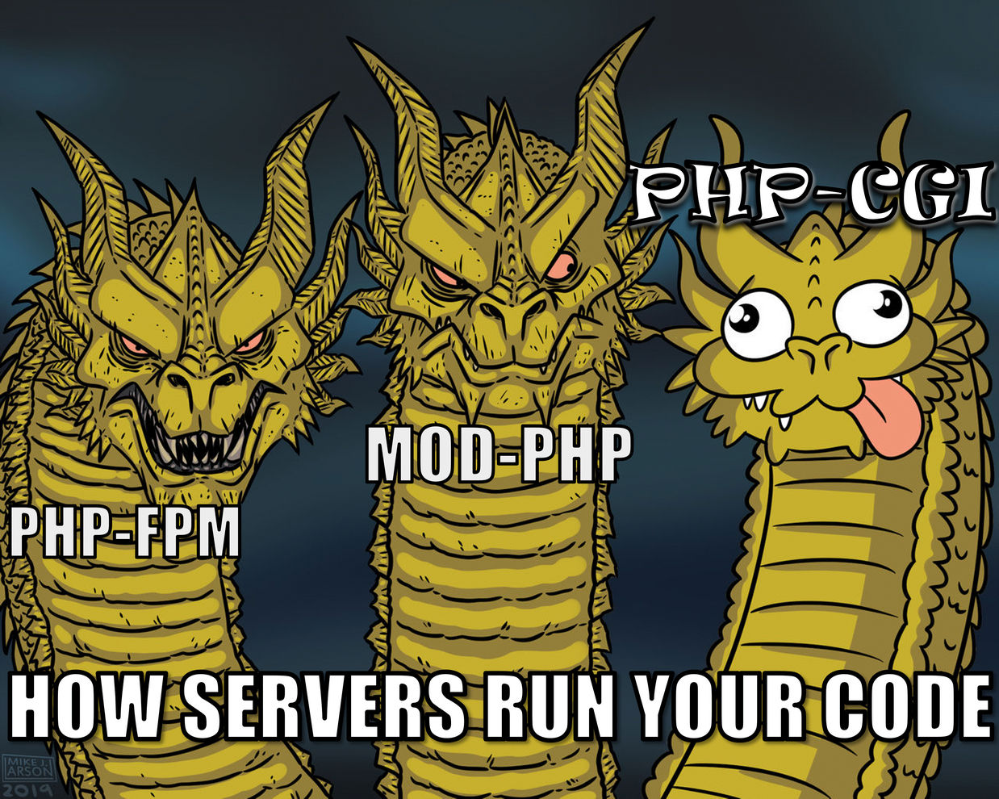

# CVE-2024-4577 PoC Exploit



## Description
This repository contains a proof-of-concept (PoC) exploit for CVE-2024-4577, a critical vulnerability affecting all versions of PHP running on Windows. The vulnerability allows attackers to execute arbitrary code remotely. The flaw also impacts the XAMPP development environment installed on Windows systems. Researchers have observed active scanning for this vulnerability, making it crucial for affected organizations to update their PHP installations promptly.

## Vulnerability Details
The vulnerability stems from an argument injection bug resulting from an incomplete fix for a separate vulnerability dating back to 2012 (CVE-2012-1823). The PHP development team overlooked the Best-Fit feature of encoding conversion within the Windows operating system, allowing unauthenticated attackers to bypass previous protections. This oversight enables attackers to execute arbitrary code on remote PHP servers through an argument injection attack.

## Exploitation Scenarios
1. **PHP Running in CGI Mode:** Attackers can exploit this vulnerability directly when PHP is configured in CGI mode, commonly used in web server setups.
2. **Exposed PHP Binary in CGI Directory (XAMPP):** The default mode for XAMPP, a popular PHP development environment, exposes the PHP binary in the CGI directory, making it vulnerable to exploitation.

## Usage
1. Install the tool using the command:
   ```
   go install -v github.com/zomasec/CVE-2024-4577/cmd/CVE-2024-4577
   ```

2. Use the tool with the following flags:
   ```
   CVE-2024-4577 -l/-d <hostsFile>/<host> -c <concurrency> -timeout <timeout>
   ```
   - `-l`: File containing a list of hosts to scan.
   - `-d`: Single host to scan.
   - `-c`: Number of concurrent scans (default is 10).
   - `-timeout`: Request timeout in seconds (default is 5).

   Example:
   ```
   CVE-2024-4577 -l hosts.txt -c 20 -timeout 10
   ```
3. You can use these dorks :
Hunter:```header.server="PHP"```
FOFA: ```server="PHP"```
SHODAN: ```server: PHP os:Windows```

 
---

## Resources
1. [Tenable Blog - CVE-2024-4577 Proof of Concept Available for PHP CGI Argument Injection Vulnerability](https://www.tenable.com/blog/cve-2024-4577-proof-of-concept-available-for-php-cgi-argument-injection-vulnerability)
2. [Duo Decipher - Critical PHP Flaw CVE-2024-4577 Patched](https://duo.com/decipher/critical-php-flaw-cve-2024-4577-patched)
